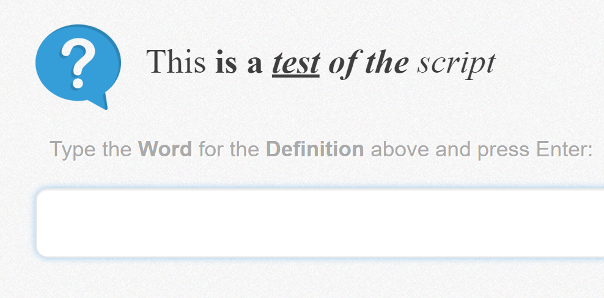

# Memrise Render HTML

Render html for your words in test screens.

For example:

gives you this:

### Installation

The easiest method is through an extension/add-on on chrome/firefox:

- Chrome: install the [Tampermonkey](https://chrome.google.com/webstore/detail/dhdgffkkebhmkfjojejmpbldmpobfkfo) extension
- Firefox: install the [Greasemonkey](https://addons.mozilla.org/en-US/firefox/addon/greasemonkey/) add-on

Then add the script using the following link: https://github.com/cooljingle/memrise-render-html/raw/master/Memrise_Render_HTML.user.js
